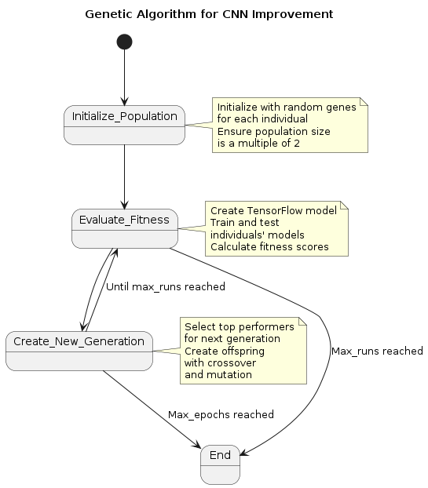

# Cifar10 with Evolutionary Algorithms

This project focusses on improve a Convolutional Neural Network (CNN) using evolutionary algorithms. The primary focus is on optimizing the CNN architecture for the CIFAR-10 dataset. 

## Idea and Flow


This diagram was made with PlantUML and shows how the algorithm is supposed to work. Initialization is random, however it does obey certain laws, so that the CNNs do not get too big or get wrong formats for the CIFAR-10 dataset. Models are then created using TensorFlow and evaluated. Their overall testing set score is used as fitness score. In the next generation we create offspring by [elitism](https://www.igi-global.com/dictionary/multi-objective-evolutionary-algorithms/9592#:~:text=Elitist%20algorithms%20make%20sure%20that,directly%20into%20the%20next%20generation.&text=Taking%20the%20best%20attributes%20of,without%20applying%20any%20genetic%20operators.). The worst population is then discarded for the offspring and a new iteration is run.

## Setup virtual environment (python 3.10 or higher)
To get started, it is recommended to create a virtual environment to run all the scripts.

```
python3 -m venv --system-site-packages env
source env/bin/activate
pip install --upgrade pip
pip install -r requirements.txt
```

After verifying that the environment is created and all necessary packages are installed, download all the necessary datasets using
```
python setup.py
```

After having downloaded the ncessary files simply run the main file using (I have not implemented an argument parser yet so the main configurations of the algorithm can be changed in the main.py file)
```
python main.py
```
